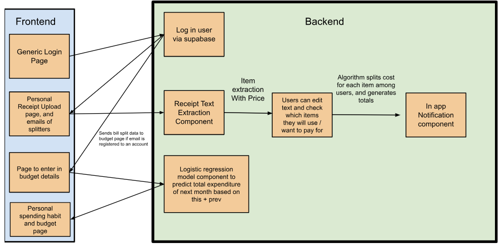

# CS 222 FA25-TEAM065: Splitify, A Financial Receipt Splitting Assistant and Budgeting App

A comprehensive, full-stack application designed for efficient financial management, featuring machine learning-assisted receipt processing, detailed budgeting tools, and secure user management with group joining features.

## Key Features

The application delivers a set of features across both the client and server:

* **Intelligent Expense Tracking:** Dedicated user interface (`4_ReceiptUploadUI.tsx`) to upload receipts, utilizing the Python backend's OCR capabilities to extract line items and amounts.
* **Detailed Transaction Review:** Workflow page (`5_LineItemsSelectPage.tsx`) allowing users to review, edit, and categorize items extracted from receipts before saving.
* **Comprehensive Budgeting:** Dedicated `8_BudgetDashboard.tsx` for creating, monitoring, and managing spending limits across custom categories.
* **Financial Visualization:** Primary dashboard (`3_Dashboard.tsx`) providing an immediate overview of financial status and budget, recent transactions, and budget progress.
* **Secure Authentication:** Full user authentication managed via **Supabase** services, including dedicated pages for `2_LoginPage.tsx` and `7_RegisterPage.tsx`.
* **In-App Alerts:** The system uses **in-app notifications** (`8_NotificationsPage.tsx`) for communicating alerts and updates to the user, **without sending external emails**.

## Technical Architecture Overview

The project follows a standard three-tier architecture: Presentation (Frontend), Application Logic (Backend), and Data (Supabase/DB). 


## Components


### A. Frontend

The user interface is a simple page application built with **React** and **TypeScript** for performance and type-safety.

| Component Path | Functionality |
| :--- | :--- |
| `src/components/` | Contains all major screens and reusable UI components. |
| `src/services/` | Abstracted logic for API calls and integration with Supabase, including `authService.ts`. |
| `src/lib/supabase/` | Direct Supabase client configuration and initialization. |
| `public/` | Static assets, including the main entry point `index.html`. |

### B. Backend (Application Logic)

The core logic and data processing layer is written in **Python**.

| File Name | Role |
| :--- | :--- |
| `backend/api_server.py` | The main server entry point, defining and routing API endpoints. |
| `backend/train_model.py` | Script used to train the machine learning model, likely for automated expense categorization or fraud detection. |
| `backend/generate_training_data.py` | Script for preparing or generating data required for model training. |
| `backend/test_system.py` | Contains unit or integration tests for the backend services. |
| `backend/requirements.txt` | Defines all necessary Python dependencies (e.g., framework, ML libraries). |

## Getting Started with Setup

### Prerequisites

* Git
* Python 3.x (with `pip`)
* Node.js (version 14 or higher)
* npm or yarn

### A. Repository Setup

1.  **Clone the Repository:**
    ```bash
    git clone [https://github.com/CS222-UIUC/fa25-fa25-team065.git](https://github.com/CS222-UIUC/fa25-fa25-team065.git)
    cd fa25-fa25-team065
    ```
2.  **Configure Environment Variables:**
    Create a `.env.local` file in the root directory and populate it with necessary service keys (Supabase URL, API keys, etc.).

### B. Backend Installation and Run

1.  **Create and Activate Virtual Environment:**
    ```bash
    python -m venv venv
    source venv/bin/activate  # On Linux/macOS/Git Bash
    # venv\Scripts\activate.bat  # On Windows Command Prompt
    ```
2.  **Install Python Dependencies:**
    ```bash
    pip install -r backend/requirements.txt
    ```
3.  **Run the Backend Server:**
    ```bash
    python backend/api_server.py
    ```

### C. Frontend Installation and Run

1.  **Install Node Dependencies:**
    ```bash
    npm install
    # OR
    yarn install
    ```
2.  **Start the Development Server:**
    ```bash
    npm start
    ```
The application should now be live at `http://localhost:3000`. This application can also be accessed with our Vercel link (fa25-splitify.vercel.app/)

## 4. Group Members and Their Roles

In this project, we all rotated roles but focused specifically on individual aspects. 

| Cindy Zou (cindyz3) | Frontend | Component architecture, state management, Dashboard and UI/UX implementation. |
| Kaavya Vassa (kvassa2) | Backend & AI | API development, machine learning model training and OCR integration. |
| Ananya Anand (ananyaa9) | Backend & Database & Auth | Supabase integration, user authentication flow, and data schema design. |
| Aparna Kudiyirikkal Anil (aparnak5) | Backend & Feature | Receipt upload, budgeting features, and transaction workflow. |